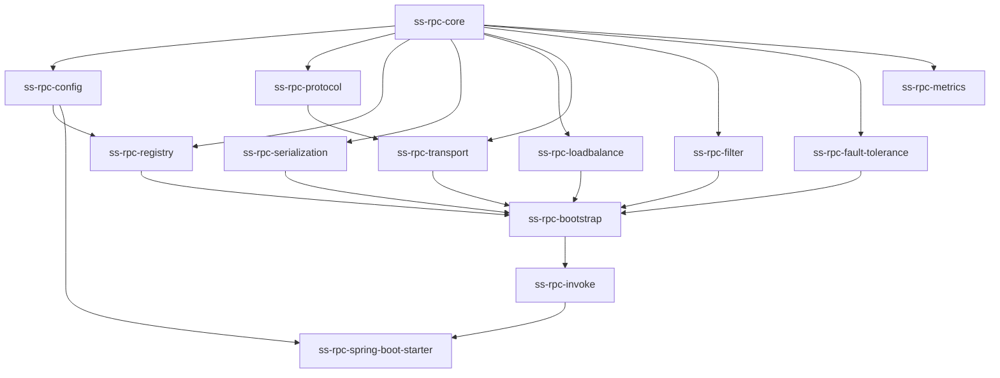

# SS-RPC 架构重构执行计划

## 🎯 重构目标

1. **消除模块职责重叠**：明确各模块边界
2. **优化依赖关系**：建立清晰的分层架构
3. **增强可扩展性**：支持插件化机制
4. **提升开发体验**：更简洁的API设计

## 📋 重构阶段计划

### 🔥 阶段一：模块职责重新划分（优先级：高）

#### 1.1 ss-rpc-core 模块重构
**当前问题**：包含过多职责，与其他模块重叠

**重构步骤**：
```bash
# 1. 保留核心功能
ss-rpc-core/
├── annotation/          # ✅ 保留 - RPC注解定义
├── config/             # ⚠️ 移动到 ss-rpc-config
├── context/            # ✅ 保留 - RPC上下文
├── exception/          # ✅ 保留 - 异常体系
├── proxy/              # ✅ 保留 - 代理相关
├── invoker/            # ⚠️ 评估是否移动到 ss-rpc-invoke
├── filter/             # ⚠️ 移动到 ss-rpc-filter（新建）
├── fault/              # ⚠️ 移动到 ss-rpc-fault-tolerance（新建）
├── util/               # ✅ 保留 - 工具类
├── loadbalance/        # ❌ 删除 - 与 ss-rpc-loadbalance 重复
├── registry/           # ❌ 删除 - 与 ss-rpc-registry 重复
├── discovery/          # ❌ 删除 - 移到 ss-rpc-registry
└── router/             # ⚠️ 评估职责，可能移到 ss-rpc-loadbalance
```

#### 1.2 新建必要模块

##### ss-rpc-config 模块（新建）
```xml
<!-- pom.xml -->
<artifactId>ss-rpc-config</artifactId>
<dependencies>
    <dependency>
        <groupId>com.ssrpc</groupId>
        <artifactId>ss-rpc-core</artifactId>
    </dependency>
</dependencies>
```

**功能**：
- 配置加载和管理
- 配置热更新
- 多环境配置
- 配置验证

##### ss-rpc-filter 模块（新建）
```xml
<artifactId>ss-rpc-filter</artifactId>
<dependencies>
    <dependency>
        <groupId>com.ssrpc</groupId>
        <artifactId>ss-rpc-core</artifactId>
    </dependency>
</dependencies>
```

**功能**：
- 过滤器链管理
- 内置过滤器实现
- 自定义过滤器支持

##### ss-rpc-fault-tolerance 模块（新建）
```xml
<artifactId>ss-rpc-fault-tolerance</artifactId>
<dependencies>
    <dependency>
        <groupId>com.ssrpc</groupId>
        <artifactId>ss-rpc-core</artifactId>
    </dependency>
</dependencies>
```

**功能**：
- 熔断器
- 重试机制  
- 超时控制
- 降级处理

##### ss-rpc-metrics 模块（新建）
```xml
<artifactId>ss-rpc-metrics</artifactId>
<dependencies>
    <dependency>
        <groupId>com.ssrpc</groupId>
        <artifactId>ss-rpc-core</artifactId>
    </dependency>
    <dependency>
        <groupId>io.micrometer</groupId>
        <artifactId>micrometer-core</artifactId>
    </dependency>
</dependencies>
```

**功能**：
- 调用统计
- 性能监控
- 健康检查
- Prometheus集成

### 🚀 阶段二：依赖关系优化（优先级：高）

#### 2.1 重新定义模块依赖层次



#### 2.2 更新 pom.xml 依赖管理

```xml
<!-- 父 pom.xml 新增模块 -->
<modules>
    <!-- 基础层 -->
    <module>ss-rpc-core</module>
    <module>ss-rpc-protocol</module>
    <module>ss-rpc-config</module>
    
    <!-- 功能层 -->
    <module>ss-rpc-serialization</module>
    <module>ss-rpc-registry</module>
    <module>ss-rpc-loadbalance</module>
    <module>ss-rpc-transport</module>
    <module>ss-rpc-filter</module>
    <module>ss-rpc-fault-tolerance</module>
    <module>ss-rpc-metrics</module>
    
    <!-- 组装层 -->
    <module>ss-rpc-bootstrap</module>
    <module>ss-rpc-invoke</module>
    
    <!-- 集成层 -->
    <module>ss-rpc-spring-boot-starter</module>
    
    <!-- 应用层 -->
    <module>ss-rpc-examples</module>
    <module>ss-rpc-test</module>
</modules>
```

### ⚙️ 阶段三：SPI机制实现（优先级：中）

#### 3.1 设计SPI接口

```java
// ss-rpc-core 中定义SPI接口
public interface Serializer {
    byte[] serialize(Object obj);
    <T> T deserialize(byte[] data, Class<T> clazz);
    String getType();
}

@SPI("json")  // 默认实现
public interface LoadBalancer {
    <T> T select(List<T> servers, RpcRequest request);
    String getType();
}

@SPI("zookeeper")
public interface Registry {
    void register(ServiceInstance instance);
    void unregister(ServiceInstance instance);
    List<ServiceInstance> discover(String serviceName);
    String getType();
}
```

#### 3.2 实现SPI加载器

```java
public class ExtensionLoader<T> {
    private static final ConcurrentMap<Class<?>, ExtensionLoader<?>> 
        EXTENSION_LOADERS = new ConcurrentHashMap<>();
    
    public static <T> ExtensionLoader<T> getExtensionLoader(Class<T> type) {
        // SPI加载逻辑
    }
    
    public T getExtension(String name) {
        // 获取具体实现
    }
}
```

### 🔧 阶段四：配置管理优化（优先级：中）

#### 4.1 统一配置结构

```yaml
# application.yml
ss-rpc:
  application:
    name: user-service
    version: 1.0.0
  
  server:
    port: 20880
    protocol: ss-rpc
    
  client:
    timeout: 3000
    retries: 3
    
  registry:
    type: zookeeper
    address: 127.0.0.1:2181
    
  serialization:
    type: json
    
  loadbalance:
    type: random
    
  metrics:
    enabled: true
    port: 8081
```

#### 4.2 配置类设计

```java
@ConfigurationProperties(prefix = "ss-rpc")
@Data
public class RpcProperties {
    private Application application = new Application();
    private Server server = new Server();
    private Client client = new Client();
    private Registry registry = new Registry();
    // ...
}
```

## 🗓️ 执行时间表

### 第1周：模块重构基础工作
- [ ] 创建新模块项目结构
- [ ] 重构 ss-rpc-core 模块
- [ ] 移动代码到合适的模块

### 第2周：依赖关系优化
- [ ] 更新所有模块的 pom.xml
- [ ] 解决循环依赖问题
- [ ] 运行测试确保功能正常

### 第3周：SPI机制实现
- [ ] 设计并实现SPI框架
- [ ] 重构现有实现为SPI插件
- [ ] 编写SPI使用文档

### 第4周：配置管理和测试
- [ ] 实现统一配置管理
- [ ] 完善单元测试
- [ ] 集成测试验证

## ⚠️ 风险控制

### 重构风险
1. **功能回归**：每个阶段完成后进行回归测试
2. **性能下降**：增加性能测试，确保重构后性能不下降
3. **API变更**：保持对外API兼容性，内部重构透明化

### 回滚计划
1. **Git分支管理**：每个阶段独立分支，出现问题及时回滚
2. **功能开关**：新功能使用开关控制，出现问题可以快速关闭
3. **版本管理**：采用语义化版本，明确标识变更影响

## ✅ 完成标准

### 代码质量标准
- [ ] 所有模块职责单一且清晰
- [ ] 无循环依赖
- [ ] 代码覆盖率 > 80%
- [ ] 通过CheckStyle检查

### 性能标准
- [ ] TPS不低于重构前
- [ ] 内存使用优化
- [ ] 启动时间不超过重构前10%

### 文档标准
- [ ] 架构文档更新
- [ ] API文档完整
- [ ] 使用示例齐全

## 🎉 预期收益

1. **开发效率提升30%**：清晰的模块边界降低理解成本
2. **扩展性增强**：SPI机制支持插件化扩展
3. **维护成本降低**：模块化设计便于定位和修复问题
4. **用户体验改善**：更简洁的配置和更好的错误提示 